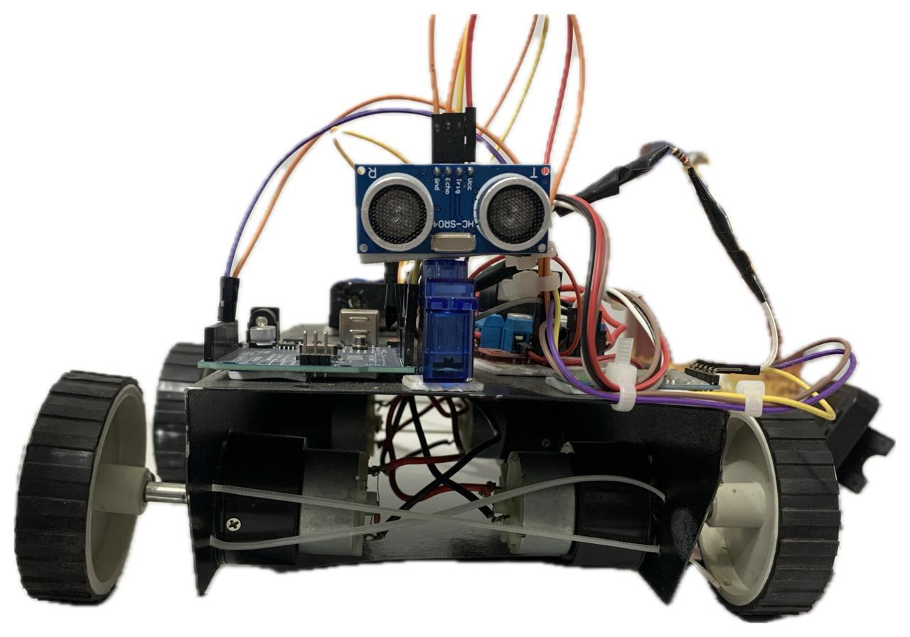
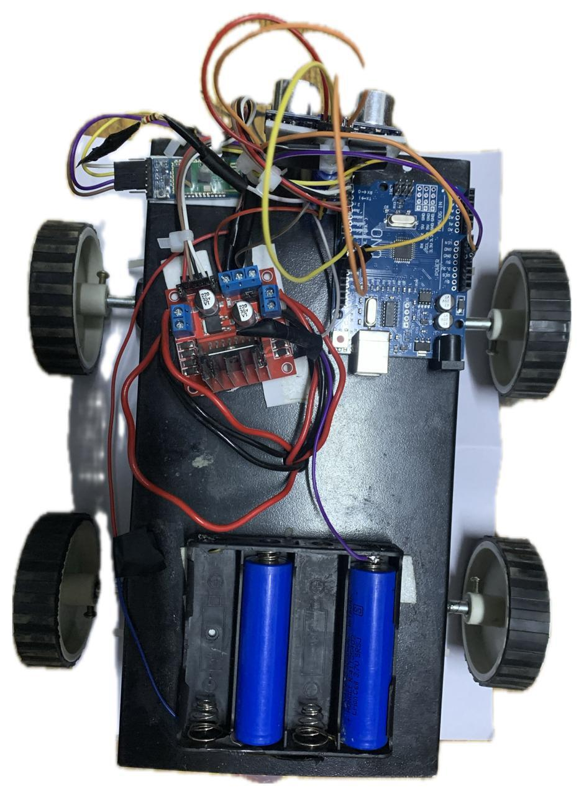

# Follow-me-RC-car
Arduino-based RC car with Bluetooth control and autonomous follow-me mode
# 🤖 Autonomous + Manual RC Car (Follow-Me Robot)

An Arduino-based robotic car capable of both **Bluetooth-controlled manual operation** and **autonomous follow-me behavior** using ultrasonic sensing and servo-based scanning.

---

## 🚀 Features

- 📱 Manual control via smartphone using HC-05 Bluetooth module  
- 🤖 Autonomous "follow-me" mode using ultrasonic sensor  
- 🔄 Servo-based directional scanning  
- ⚡ Real-time distance detection and tracking  
- 🔁 Seamless switching between manual and autonomous modes  
- 🎯 Motor control using L298N motor driver  

---

## 🛠️ Tech Stack

- Arduino Uno  
- HC-05 Bluetooth Module  
- Ultrasonic Sensor (HC-SR04)  
- Servo Motor  
- L298N Motor Driver  
- DC Motors  
- 9V/12V Power Supply  

---

## 🎥 Demo Video

[Watch Manual Control Demo](https://youtube.com/shorts/BDjcgcHtT9c?feature=share)

🎥 Demonstrates Bluetooth-based manual control of the RC car  
⚙️ Autonomous follow-me mode implemented and explained below

---

## 📸 Project Images

### 🔹 Front View

### 🔹 Top View

### 🔹 Internal Wiring

---

## ⚙️ How It Works

### 🔹 Manual Mode
- Smartphone sends commands via Bluetooth (HC-05)
- Arduino receives commands and processes them
- Motor driver controls direction (forward, backward, left, right, stop)

---

### 🔹 Autonomous Mode (Follow-Me)
- Ultrasonic sensor mounted on servo scans surroundings  
- Detects nearest object/person based on distance  
- Arduino processes sensor input and adjusts movement  
- Car follows target while maintaining a fixed range  

---

## 🔌 System Architecture
     ┌──────────────────────┐
     │   Smartphone Input   │
     └──────────┬───────────┘
                ↓
     ┌──────────────────────┐
     │ HC-05 Bluetooth Mod. │
     └──────────┬───────────┘
                ↓
     ┌──────────────────────┐
     │     Arduino Uno      │
     │   (Control Logic)    │
     └───────┬───────┬──────┘
             ↓       ↑
  ┌──────────────┐   │
  │ L298N Driver │   │
  └──────┬───────┘   │
         ↓           │
  ┌──────────────┐   │
  │  DC Motors   │   │
  └──────────────┘   │
                     │
     ┌──────────────────────┐
     │ Ultrasonic + Servo   │
     │   (Distance Input)   │
     └──────────────────────┘

---

## 🧠 Key Learnings

- Embedded systems programming using Arduino  
- Bluetooth communication and serial data handling  
- Motor driver interfacing (L298N)  
- Sensor-based control logic  
- Real-time decision making in robotics  

---

## 📌 Future Improvements

- Add computer vision for better tracking  
- Improve obstacle avoidance logic  
- Build a custom mobile control app  
- Integrate camera module for navigation  

---

## 👨‍💻 Author

**Madhav Bhanot**  
Computer Science Student | AI & Robotics  

GitHub: https://github.com/madhavbhanot6-alt
